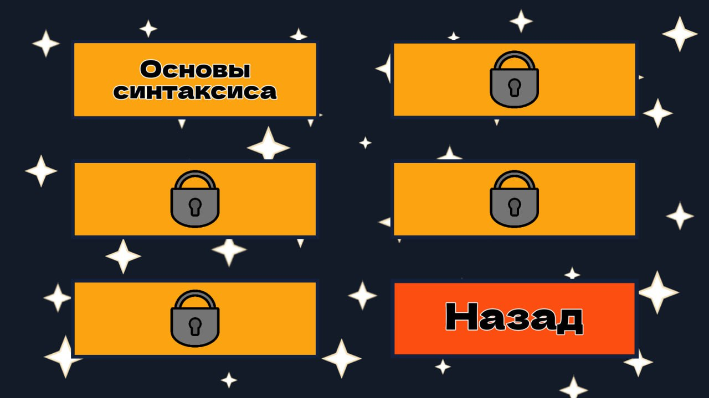
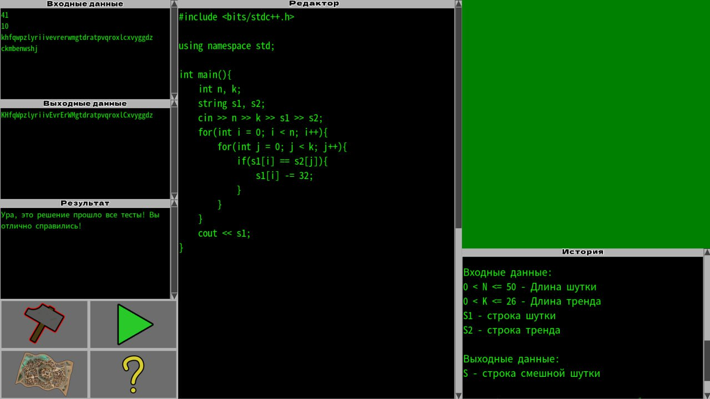

# CroakValley — визуальная новелла, обучающая программированию на C++

Геймификация сейчас является большим трендом, и обучение нуждается в ней не меньше чем остальные сферы. Данная игра сочетает в себе продуманное повествование с уроками программирования, необходимыми к прохождению для продвижения сюжета. Идея проекта появилась, когда мы заметили, что классические методы обучения часто не могут удержать внимание детей на долгое время.

Игра была впоследствии протестирована на аудитории онлайн-школы NlogN и показала отличные результаты: абсолютное большинство полюбило такой подход к обучению и оставило крайне положительные отзывы наравне с массой предложений по развитию.

# Меню с темами

# Редактор кода с решением задачи

