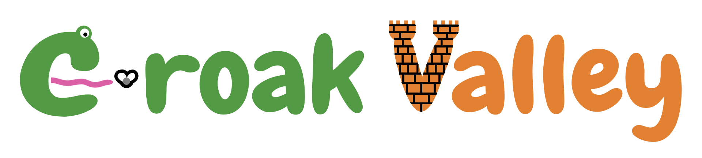

# CroakValley — визуальная новелла, обучающая программированию на C++

Геймификация сейчас является большим трендом, и обучение нуждается в ней не меньше чем остальные сферы. Данная игра сочетает в себе продуманное повествование с уроками программирования, необходимыми к прохождению для продвижения сюжета. 

Игра была протестирована на аудитории онлайн-школы NlogN, и абсолютное большинство полюбило такой подход к обучению и оставило крайне положительные отзывы и массу предложений по развитию.  
